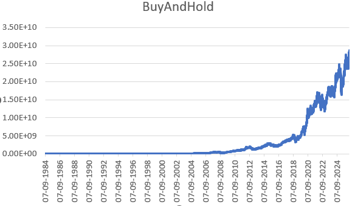
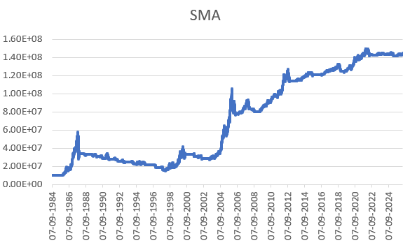

# cpp-backtester

A from-scratch, event-driven backtester for OHLCV equity data written in modern C++20. Reads daily bars from a CSV, runs a pluggable strategy bar-by-bar, fills orders at the next bar's open (no lookahead), and reports return, max drawdown, and Sharpe ratio along with a per-bar equity curve.

No external runtime dependencies beyond the C++ standard library. Builds with CMake on Windows, Linux, and macOS.

## Results

Backtests run on 10,501 daily bars of split-adjusted AAPL data (1984-09-07 → 2026-05-13) with $10,000,000 starting cash and $9,500,000 deployed per trade.

| Strategy   | Trades | Total Return | Max Drawdown | Sharpe |
| ---------- | -----: | -----------: | -----------: | -----: |
| Buy & Hold |      1 |     286,200% |        81.5% |   0.67 |
| SMA 50/200 |     53 |       1,346% |        74.2% |   0.46 |




The SMA crossover takes less risk and trades far more often, yet underperforms buy-and-hold by roughly two orders of magnitude on a long-running bull-trend stock. Sharpe ratios cross-check against external sources: AAPL's long-horizon CAGR is ~21% (matches the 286,200% over 42 years) and the 81% drawdown matches the 2000–2003 dot-com unwind. The metric module is verified against these external reference points before any strategy is evaluated.

## Quick start

```bash
git clone https://github.com/A-I-dtya/cpp-backtester.git
cd cpp-backtester
cmake -B build -S .
cmake --build build

# Buy & Hold on AAPL
./build/backtester --strategy bh --cash 10000000 --target 9500000

# SMA 50/200 crossover on AAPL
./build/backtester --strategy sma --cash 10000000 --target 9500000 --short 50 --long 200

# Help
./build/backtester --help
```

On Windows with MinGW, configure with `-G "MinGW Makefiles"` and run `backtester.exe`.

Each run writes a per-bar equity curve to `equity_curve.csv` for plotting.

## Architecture

The engine is decomposed into orthogonal components so any one can be swapped without touching the others:

- **`Bar`** — one row of OHLCV data; the unit of historical input.
- **`Order`** — symbol plus signed quantity (positive = buy, negative = sell).
- **`Strategy`** — abstract base class. Receives a `Bar`, returns a vector of `Order`s.
- **`Portfolio`** — owns cash and positions; enforces pre-trade buying-power checks; rejects orders that would create leverage or short positions.
- **`Engine`** — the main loop. Per bar: call strategy → fill orders at the next bar's open → mark equity at today's close.
- **`Metrics`** — computes total return, max drawdown, and annualized Sharpe ratio from an equity curve.
- **`CsvReader` / `EquityCurveWriter`** — CSV input/output, header-only.
- **`indicators/SimpleMovingAverage`** — O(1) sliding-window SMA used by signal-based strategies.
- **`strategies/`** — concrete `Strategy` implementations: `BuyAndHoldStrategy`, `SmaCrossoverStrategy`, `DoNothingStrategy`.

## Design decisions

**No-lookahead-bias fills.** Orders emitted while looking at bar *N* fill at the open of bar *N+1*. This rules out the most common backtester bug: filling at the bar's close (price the strategy was allowed to see when deciding), which silently inflates results.

**Cash-enforced order matching.** `Portfolio::apply_fill` returns `false` when a buy exceeds available cash or a sell exceeds the held position. This mirrors how a real broker's pre-trade buying-power check works and was added after an initial run revealed accidental 9.5× leverage when a fixed dollar-target exceeded the starting cash. The engine separately counts emitted, filled, and rejected orders so position-sizing bugs surface immediately instead of producing plausible-but-wrong PnL.

**Dollar-target position sizing.** The SMA strategy deploys a fixed dollar amount per trade rather than a fixed share count. An early version using `trade_size = 100` shares produced near-zero returns on AAPL: at $0.10 per share in 1984, 100 shares is a $10 position in a $10M account. Dollar-target sizing keeps capital deployment consistent across regimes.

**Per-symbol position tracking.** `Portfolio` uses an `unordered_map<string, int>` even though the current backtests are single-asset, so multi-asset strategies don't require a refactor.

**Long-only by default.** `apply_fill` rejects selling more than the held position. A short-selling mode is planned (see Future work) but is gated behind an explicit flag so the default backtest can't accidentally take a short position.

## Verification

Engine correctness is verified arithmetically against a known result before any strategy is evaluated. For a buy-and-hold of 100 shares at the day-1 open, expected final equity is `starting_cash − 100 × open[1] + 100 × close[last]`, and the engine's output matches this to the cent. Metrics are cross-checked against external references: AAPL's historical CAGR (~21%), drawdown peaks (1987, 2000–2003, 2008, 2022), and reasonable Sharpe ranges for long-only single-stock strategies (0.4–0.8).

## Project layout

cpp-backtester/
├── CMakeLists.txt
├── data/
│   └── AAPL.csv                    # Daily split-adjusted OHLCV (Stooq)
└── src/
├── main.cpp
├── CliArgs.hpp
├── Bar.hpp
├── Order.hpp
├── Strategy.hpp
├── Portfolio.hpp
├── Engine.hpp
├── CsvReader.hpp
├── EquityCurveWriter.hpp
├── Metrics.hpp
├── indicators/
│   └── SimpleMovingAverage.hpp
└── strategies/
├── DoNothingStrategy.hpp
├── BuyAndHoldStrategy.hpp
└── SmaCrossoverStrategy.hpp

## Future work

- Unit tests with GoogleTest (Portfolio edge cases, Metrics formulas, SMA invariants)
- GitHub Actions CI building on Ubuntu and Windows
- Configurable short-selling mode with margin requirements
- Additional strategies: mean reversion, momentum, pairs trade
- Throughput benchmarks (bars/sec) and a profiling pass
- Multi-asset backtesting with a portfolio-level Sharpe and correlation matrix

## Data source

Daily split-adjusted OHLCV data sourced from [Stooq](https://stooq.com).